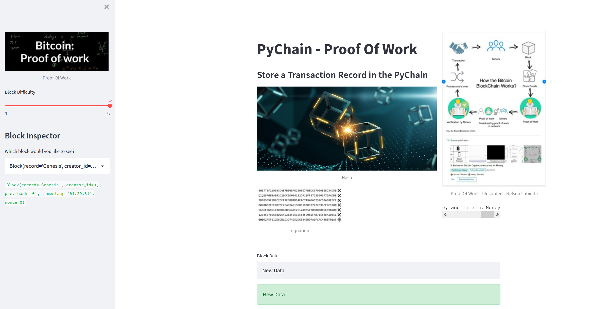
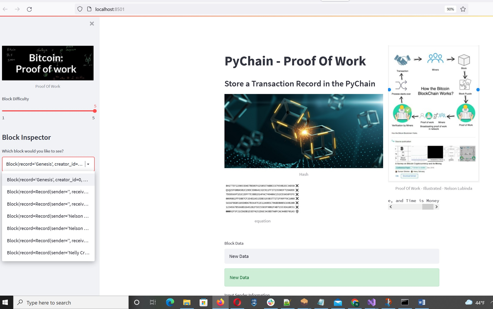
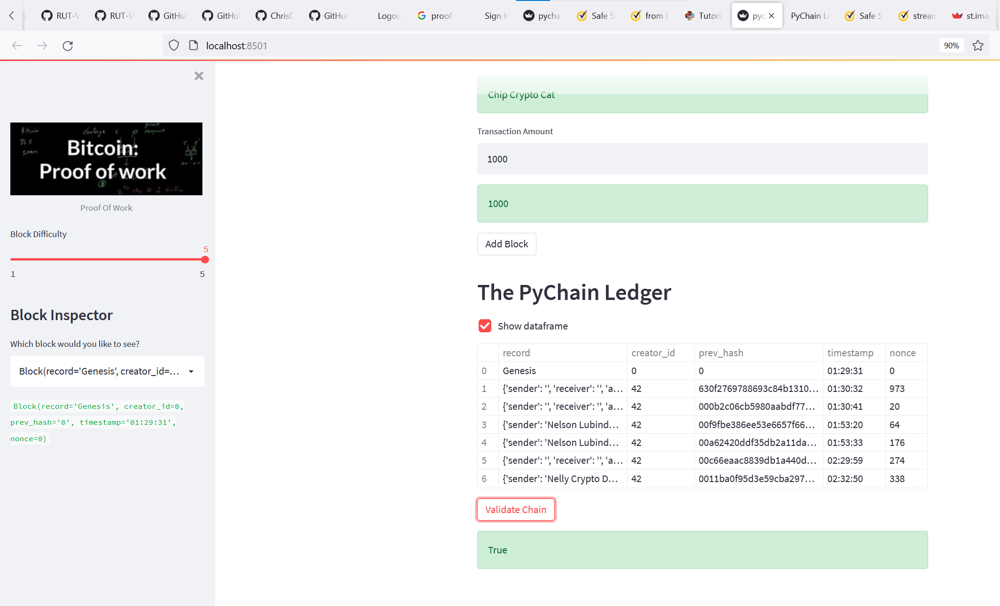

# PyChain Ledger

Tasks Completed:

1. Created a new data class named `Record`. This class serves as the blueprint for the financial transaction records that the blocks of the ledger will store.

2. Modified the existing `Block` data class to store `Record` data.

3. Added Relevant User Inputs to the Streamlit interface.

4. Tested the PyChain Ledger by Storing Records.

---
## SCREEN SHOTS |  Step 1: Create a Record Data Class | Step 2: Modify the Existing Block Data Class to Store Record Data

### Step 3: Add Relevant User Inputs to the Streamlit Interface  |  Step 4: Test the PyChain Ledger by Storing Records

---

© 2021 Trilogy Education Services, a 2U, Inc. brand. All Rights Reserved.
